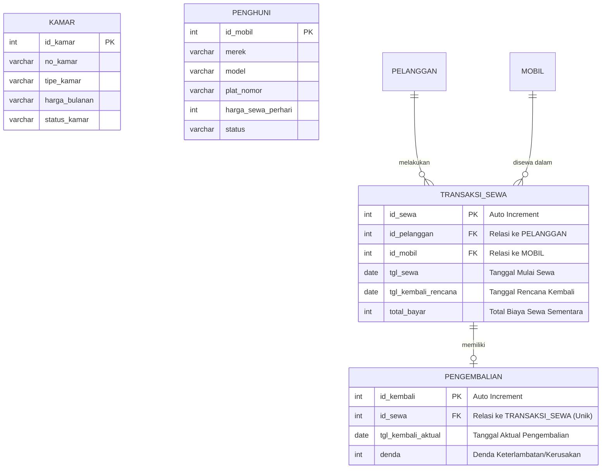

# Boarding-House-Management-Information-System
This repository contains final Database exam answer reports regarding database design, ERD documentation, normalization, SQL DDL & DML scripts, and Python and PHP based CRUD applications.

## 1. Topic
Boarding House Management Information System

## 2. Business Processes and Modules
### A. Business Process
- **Room Registration & Reservation**: Prospective residents view a list of available rooms (type, amenities, price). If interested, prospective residents register by filling in their personal information and selecting a room, then making a down payment/initial rental fee.
- **Resident & Room Management**: The owner/admin validates the payment, changes the room status to "Occupied," and actively records the resident's information.
- **Monthly Rent Payment**: Each month, the system or admin generates a rental invoice. Residents make payments, upload proof of payment, and the admin verifies it to update the bill status to "Paid."
- **Expense & Complaint Management**: Residents can file complaints about facilities (e.g., a broken air conditioner). The owner records boarding expenses (e.g., electricity bills, facility repairs).
### B. Modules
- **User & Authentication Module**: Manages login data (Admin/Owner and Resident).
- **Room Management Module**: Manages master room data (room number, type, price, availability status).
- **Registration & Tenant Module**: Manages data on active tenants.
- **Payment Transaction Module**: Manages monthly bills, rent payments, and transaction history.
- **Complaints & Maintenance Module**: Manages damage reports from tenants.

## 3. Stakeholders involved in the module
### A. Boarding House Owner/Admin:
- Involved in all modules.
- **Duties**: Manage room data, verify rental payments, update room status, and monitor complaints and expense reports.
### B. Boarding House Resident:
- **Involved in**: User Module, Registration Module, Transaction Module, and Complaints Module.
- **Duties**: Enter personal data, select rooms, make rental payments, view payment history, and create complaint reports.

## 4. Entity Relationship Diagram design, entities and relationships between entities

