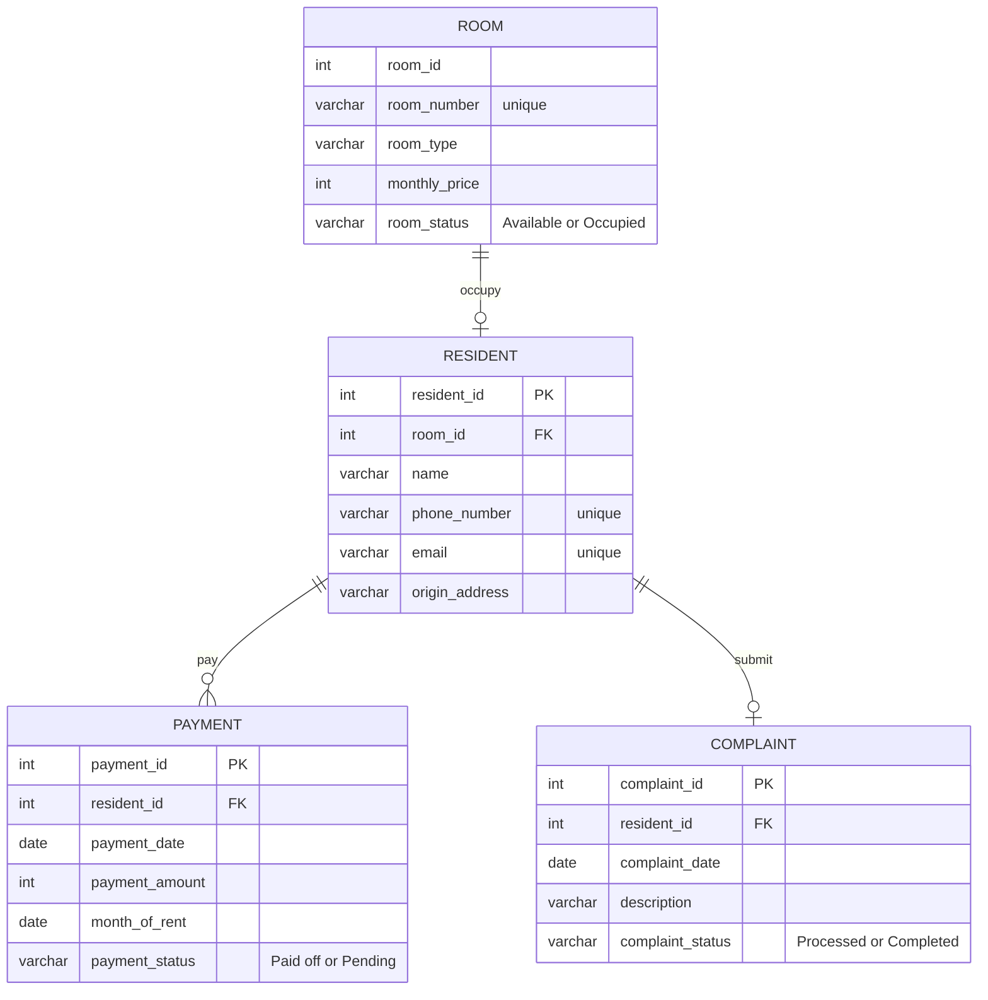

# Boarding-House-Management-Information-System
This repository contains final Database exam answer reports regarding database design, ERD documentation, normalization, SQL DDL & DML scripts, and Python and PHP based CRUD applications.

## 1. Topic
Boarding House Management Information System

## 2. Business Processes and Modules
### A. Business Process
- **Room Registration & Reservation**: Prospective residents view a list of available rooms (type, amenities, price). If interested, prospective residents register by filling in their personal information and selecting a room, then making a down payment/initial rental fee.
- **Resident & Room Management**: The owner/admin validates the payment, changes the room status to "Occupied," and actively records the resident's information.
- **Monthly Rent Payment**: Each month, the system or admin generates a rental invoice. Residents make payments, upload proof of payment, and the admin verifies it to update the bill status to "Paid."
- **Expense & Complaint Management**: Residents can file complaints about facilities (e.g., a broken air conditioner). The owner records boarding expenses (e.g., electricity bills, facility repairs).
### B. Modules
- **User & Authentication Module**: Manages login data (Admin/Owner and Resident).
- **Room Management Module**: Manages master room data (room number, type, price, availability status).
- **Registration & Tenant Module**: Manages data on active tenants.
- **Payment Transaction Module**: Manages monthly bills, rent payments, and transaction history.
- **Complaints & Maintenance Module**: Manages damage reports from tenants.

## 3. Stakeholders involved in the module
### A. Boarding House Owner/Admin:
- Involved in all modules.
- **Duties**: Manage room data, verify rental payments, update room status, and monitor complaints and expense reports.
### B. Boarding House Resident:
- **Involved in**: User Module, Registration Module, Transaction Module, and Complaints Module.
- **Duties**: Enter personal data, select rooms, make rental payments, view payment history, and create complaint reports.

## 4. Entity Relationship Diagram design, entities and relationships between entities


## 5. Cardinality in each relationship between entities
### A. Entity: ROOM
- room_id (INT, PK) — 1:1 relationship to the Occupant entity
- room_number (VARCHAR)
- room_type (VARCHAR) — Examples: En-suite Bathroom, AC, etc.
- monthly_price (INT)
- room_status (VARCHAR) — Example: Available / Occupied
### B. Entity: RESIDENT
- resident_id (INT, PK) — 1:N relation to Payments & Complaints
- room_id (INT, FK) — Guest key to record which room is occupied
- name (VARCHAR)
- phone_number (VARCHAR)
- email (VARCHAR)
- origin_address (TEXT)
### C. Entity: PAYMENT
- payment_id (INT, PK)
- resident_id (INT, FK) — Connects who the paying occupant is
- payment_date (DATE)
- payment_amount (INT)
- month_of_rent (VARCHAR) — Example: "January 2026"
- payment_status (VARCHAR) — Example: Paid / Pending
### 4. Entity: COMPLAINT
- complaint_id (INT, PK)
- resident_id (INT, FK) — Connects who the complaining occupant is
- complaint_date (DATE)
- description (TEXT)
- complaint_status (VARCHAR) — Example: Process / Completed

## 6. Database normalization process
### A. Unnormalized Form - UNF
At this stage, all data is combined into one large, unorganized table. Resident, room, payment, and complaint data are recorded repeatedly in the same row.
| Column Name           | Key Types        | Information                             |
| :-------------------- | :--------------- | :--------------------------------       |
| **resident_id**       | Primary Key (PK) | Unique ID of boarding house resident    |
| **name**              | -                | Full name of occupant                   |
| **phone_number**      | -                | Resident's phone number                 |
| **email**             | -                | Resident's email address                |
| **origin_address**    | -                | Resident's original address             |
| **room_id**           | -                | ID of the room occupied                 |
| **room_number**       | -                | Room number                             |
| **room_type**         | -                | Room type or facilities                 |
| **monthly_price**     | -                | Room rental price per month             |
| **room_status**       | -                | Room status (Available/Occupied)        |
| **payment_id**        | -                | Payment transaction ID                  |
| **payment_date**      | -                | Date payment was made                   |
| **payment_amount**    | -                | Payment amount                          |
| **month_of_rent**     | -                | Month paid                              |
| **payment_status**    | -                | Payment status (Paid/Pending)           |
| **complaint_id**      | -                | Resident Complaint ID                   |
| **complaint_date**    | -                | Date the complaint was made             |
| **description**       | -                | Content or description of the complaint |
| **complaint_status**  | -                | Complaint handling status               |

### B. First Normal Form (1NF)
The requirement for 1NF is that no attributes may have multiple values ​​or repeating groups within a single row of data. Because the UNF table structure above is broken down into atomic (single-valued) columns, the 1NF table structure is the same as the UNF table, ensuring each row of data is unique.

### C. Second Normal Form (2NF)
The requirements for 2NF are that 1NF must be met and there must be no partial dependencies. Non-key attributes must be fully dependent on the primary key. At this stage, we must split the large table into master entities to avoid unnecessary data duplication.
- **ROOM**
  | Column Name    | Key Types   |
  | :------------  | :---------- |
  | room_id        | PK          |
  | room_number    | -           |
  | room_type      | -           |
  | monthly_price  | -           |
  | room_status    | -           |
- **RESIDENT** (same as 2NF)
  | Column Name    | Key Types   |
  | :----------    | :---------- |
  | resident_id    | PK          |
  | room_id        | FK          |
  | name           | -           |
  | phone_number   | -           |
  | email          | -           |
  | origin_address | -           |
- **PAYMENT** 
  | Column Name       | Key Types   |
  | :---------------- | :---------- |
  | payment_id        | PK          |
  | resident_id       | FK          |
  | payment_date      | -           |
  | payment_amount    | -           |
  | month_of_rent     | -           |
  | payment_status    | -           |
- **COMPLAINT**
  | Column Name      | Key Types   |
  | :--------------  | :---------- |
  | complaint_id     | PK          |
  | resident_id      | FK          |
  | complaint_date   | -           |
  | description      | -           |
  | complaint_status | -           |

### D. Third Normal Form (3NF)
The 3NF requirement is that 2NF must be met and there must be no transitive dependencies (non-key attributes depending on other non-key attributes).

Therefore, payment transaction and complaint report data, which were previously transitively attached, must be separated into separate transactional tables that stand alone but remain connected through the resident's foreign key.
- **ROOM** (same as 2NF)
  | Column Name    | Key Types   |
  | :------------  | :---------- |
  | room_id        | PK          |
  | room_number    | -           |
  | room_type      | -           |
  | monthly_price  | -           |
  | room_status    | -           |
- **RESIDENT** (same as 2NF)
  | Column Name    | Key Types   |
  | :----------    | :---------- |
  | resident_id    | PK          |
  | room_id        | FK          |
  | name           | -           |
  | phone_number   | -           |
  | email          | -           |
  | origin_address | -           |
- **PAYMENT** (same as 2NF)
  | Column Name       | Key Types   |
  | :---------------- | :---------- |
  | payment_id        | PK          |
  | resident_id       | FK          |
  | payment_date      | -           |
  | payment_amount    | -           |
  | month_of_rent     | -           |
  | payment_status    | -           |
- **COMPLAINT** (same as 2NF)
  | Column Name      | Key Types   |
  | :--------------  | :---------- |
  | complaint_id     | PK          |
  | resident_id      | FK          |
  | complaint_date   | -           |
  | description      | -           |
  | complaint_status | -           |
There is no change from 2NF. Because there are no transitive dependencies and all non-key attributes depend directly on the primary key of each table.

## 7. Implement database design
```
-- 1. Create and Initialize Database
CREATE DATABASE db_boarding_house;
USE db_boarding_house;

-- 2. Create Master Table: tb_room
CREATE TABLE tb_room (
room_id INT AUTO_INCREMENT,
room_number VARCHAR(10) NOT NULL,
room_type VARCHAR(50) NOT NULL,
monthly_price INT NOT NULL,
room_status ENUM('Available', 'Occupied') DEFAULT 'Available',
PRIMARY KEY (room_id)
) ENGINE=InnoDB;

-- 3. Create Master Table: tb_resident
-- Note: room_id is set to UNIQUE to guarantee a 1:1 relationship
-- (one active resident per room layout)
CREATE TABLE tb_resident (
resident_id INT AUTO_INCREMENT,
room_id INT UNIQUE,
resident_name VARCHAR(100) NOT NULL,
phone_number VARCHAR(15) NOT NULL,
email VARCHAR(100),
origin_address TEXT,
PRIMARY KEY (resident_id),
FOREIGN KEY (room_id) REFERENCES tb_room(room_id)
ON UPDATE CASCADE
ON DELETE SET NULL
) ENGINE=InnoDB;

-- 4. Create Transaction Table: tb_payment
CREATE TABLE tb_payment (
payment_id INT AUTO_INCREMENT,
resident_id INT NOT NULL,
payment_date DATE NOT NULL,
payment_amount INT NOT NULL,
month_of_rent VARCHAR(30) NOT NULL,
payment_status ENUM('Pending', 'Paid') DEFAULT 'Pending',
PRIMARY KEY (payment_id),
FOREIGN KEY (resident_id) REFERENCES tb_resident(resident_id)
ON UPDATE CASCADE
ON DELETE CASCADE
) ENGINE=InnoDB;

-- 5. Create Management Table: tb_complaint
CREATE TABLE tb_complaint (
complaint_id INT AUTO_INCREMENT,
resident_id INT NOT NULL,
complaint_date DATE NOT NULL,
complaint_desc TEXT NOT NULL,
complaint_status ENUM('In-Progress', 'Completed') DEFAULT 'In-Progress',
PRIMARY KEY (complaint_id),
FOREIGN KEY (resident_id) REFERENCES tb_resident(resident_id)
ON UPDATE CASCADE
ON DELETE CASCADE
) ENGINE=InnoDB;

```

## 8. DML Process: Filling initial data/Insert, Update, and Delete
### A. Inserting Dummy Data (INSERT)
We have to insert the data sequentially: starting from the master table without dependencies (tb_room), then the master data that depends on the room (tb_resident), followed by the transaction tables (tb_payment and tb_complaint).
```
-- 1. Insert records into tb_room
INSERT INTO tb_room (room_number, room_type, monthly_price, room_status) VALUES
('A-01', 'Exclussive (AC + Private Bathroom)', 1500000, 'Occupied'),
('A-02', 'Exclussive (AC + Private Bathroom)', 1500000, 'Available'),
('B-01', 'Standard (Fan + Shared Bathroom)', 800000, 'Occupied'),
('B-02', 'Standard (Fan + Shared Bathroom)', 800000, 'Available');

-- 2. Insert records into tb_resident (Assigning them to occupied rooms)
INSERT INTO tb_resident (room_id, resident_name, phone_number, email, origin_address) VALUES
(1, 'Alya Nurin', '081234567890', 'alya.nurin@email.com', 'Pasuruan, East Java'),
(3, 'Farhan Wijaya', '085712345678', 'farhan.w@email.com', 'Surabaya, East Java');

-- 3. Insert records into tb_payment
INSERT INTO tb_payment (resident_id, payment_date, payment_amount, month_of_rent, payment_status) VALUES
(1, '2026-06-01', 1500000, 'June 2026', 'Paid'),
(2, '2026-06-02', 800000, 'June 2026', 'Pending');

-- 4. Insert records into tb_complaint
INSERT INTO tb_complaint (resident_id, complaint_date, complaint_desc, complaint_status) VALUES
(1, '2026-06-05', 'Air conditioner (AC) is leaking water.', 'In-Progress'),
(2, '2026-06-06', 'Bathroom light bulb is broken.', 'In-Progress');
```
### B. Updating Records (UPDATE)
The following are common update query scenarios that occur in boarding house management systems, such as changing complaint status or updating payment status.
```
-- Scenario 1: Update complaint status to 'Completed' once the facility is fixed
UPDATE tb_complaint 
SET complaint_status = 'Completed' 
WHERE complaint_id = 2;

-- Scenario 2: Update payment status to 'Paid' after verifying a payment transaction
UPDATE tb_payment 
SET payment_status = 'Paid' 
WHERE payment_id = 2;

-- Scenario 3: Update a resident's contact details
UPDATE tb_resident 
SET phone_number = '081299998888' 
WHERE resident_id = 1;
```
### C. Deleting Records (DELETE)
Following is the command to delete certain data records from a table.
```
-- Scenario 1: Delete a specific complaint record
DELETE FROM tb_complaint 
WHERE complaint_id = 1;

-- Scenario 2: Delete a resident who is checking out from the boarding house
-- (Note: Because of ON DELETE SET NULL on tb_resident, the corresponding room status won't break)
DELETE FROM tb_resident 
WHERE resident_id = 2;

-- Quick fix after a resident leaves: Reset the room status back to 'Available'
UPDATE tb_room 
SET room_status = 'Available' 
WHERE room_id = 3;
```

## 9. Create an application using Python and PHP for CRUD on two selected master tables.
### A. Python (CLI Application)
