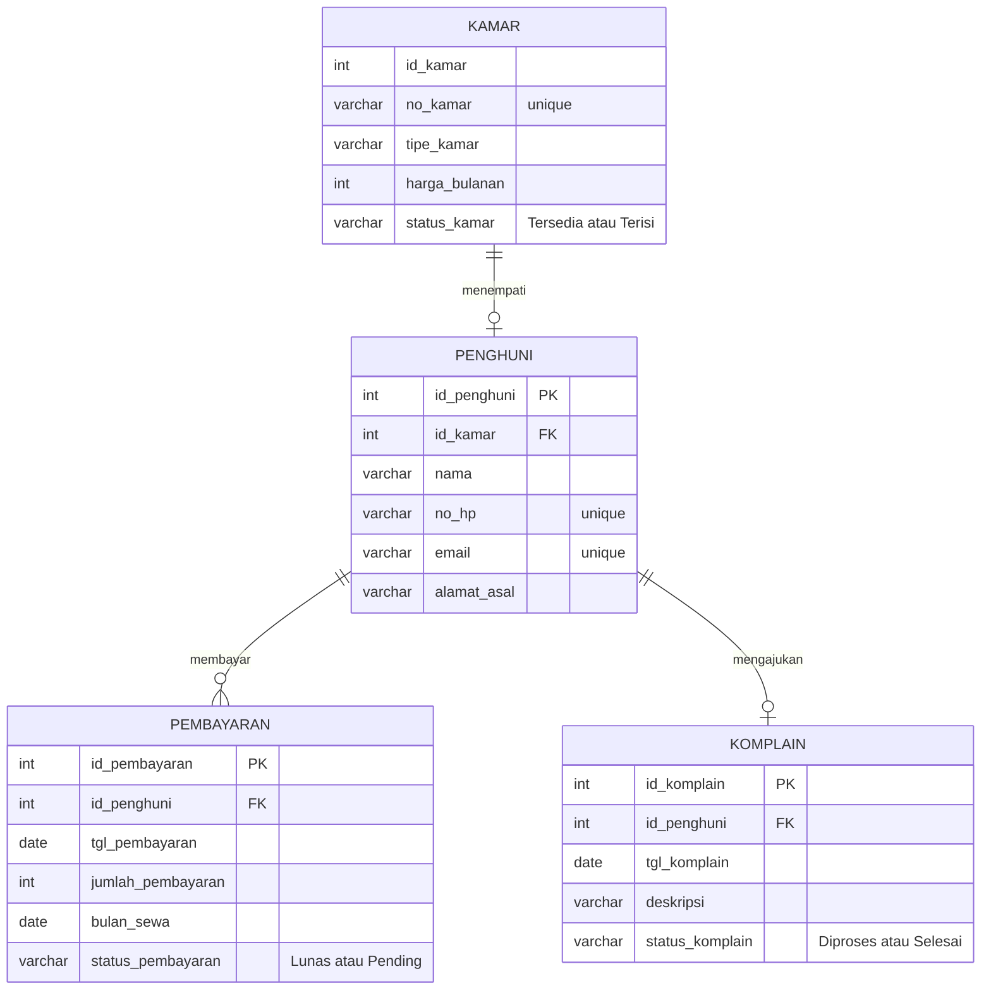

# Boarding-House-Management-Information-System
This repository contains final Database exam answer reports regarding database design, ERD documentation, normalization, SQL DDL & DML scripts, and Python and PHP based CRUD applications.

## 1. Topic
Boarding House Management Information System

## 2. Business Processes and Modules
### A. Business Process
- **Room Registration & Reservation**: Prospective residents view a list of available rooms (type, amenities, price). If interested, prospective residents register by filling in their personal information and selecting a room, then making a down payment/initial rental fee.
- **Resident & Room Management**: The owner/admin validates the payment, changes the room status to "Occupied," and actively records the resident's information.
- **Monthly Rent Payment**: Each month, the system or admin generates a rental invoice. Residents make payments, upload proof of payment, and the admin verifies it to update the bill status to "Paid."
- **Expense & Complaint Management**: Residents can file complaints about facilities (e.g., a broken air conditioner). The owner records boarding expenses (e.g., electricity bills, facility repairs).
### B. Modules
- **User & Authentication Module**: Manages login data (Admin/Owner and Resident).
- **Room Management Module**: Manages master room data (room number, type, price, availability status).
- **Registration & Tenant Module**: Manages data on active tenants.
- **Payment Transaction Module**: Manages monthly bills, rent payments, and transaction history.
- **Complaints & Maintenance Module**: Manages damage reports from tenants.

## 3. Stakeholders involved in the module
### A. Boarding House Owner/Admin:
- Involved in all modules.
- **Duties**: Manage room data, verify rental payments, update room status, and monitor complaints and expense reports.
### B. Boarding House Resident:
- **Involved in**: User Module, Registration Module, Transaction Module, and Complaints Module.
- **Duties**: Enter personal data, select rooms, make rental payments, view payment history, and create complaint reports.

## 4. Entity Relationship Diagram design, entities and relationships between entities

## 5. Cardinality in each relationship between entities
### A. Entity: KAMAR
- id_kamar (INT, PK) — 1:1 relationship to the Occupant entity
- no_kamar (VARCHAR)
- tipe_kamar (VARCHAR) — Examples: En-suite Bathroom, AC, etc.
- harga_bulanan (INT)
- status_kamar (VARCHAR) — Example: Available / Occupied
### B. Entity: PENGHUNI
- id_penghuni (INT, PK) — 1:N relation to Payments & Complaints
- id_kamar (INT, FK) — Guest key to record which room is occupied
- nama (VARCHAR)
- no_hp (VARCHAR)
- email (VARCHAR)
- alamat_asal (TEXT)
### C. Entity: PEMBAYARAN
- id_pembayaran (INT, PK)
- id_penghuni (INT, FK) — Connects who the paying occupant is
- tgl_pembayaran (DATE)
- jumlah_bayar (INT)
- bulan_sewa (VARCHAR) — Example: "January 2026"
- status_pembayaran (VARCHAR) — Example: Paid / Pending
### 4. Entity: KOMPLAIN
- id_komplain (INT, PK)
- id_penghuni (INT, FK) — Connects who the complaining occupant is
- tgl_komplain (DATE)
- deskripsi (TEXT)
- complaint status (VARCHAR) — Example: Process / Completed

## 6. Database normalization process
### A. Unnormalized Form - UNF
At this stage, all data is combined into one large, unorganized table. Resident, room, payment, and complaint data are recorded repeatedly in the same row.
| Nama Kolom            | Jenis Kunci      | Keterangan                        |
| :-------------------- | :--------------- | :-------------------------------- |
| **id_penghuni**       | Primary Key (PK) | ID unik penghuni kos              |
| **nama**              | -                | Nama lengkap penghuni             |
| **no_hp**             | -                | Nomor telepon penghuni            |
| **email**             | -                | Alamat email penghuni             |
| **alamat_asal**       | -                | Alamat asal penghuni              |
| **id_kamar**          | -                | ID kamar yang ditempati           |
| **no_kamar**          | -                | Nomor kamar                       |
| **tipe_kamar**        | -                | Jenis atau fasilitas kamar        |
| **harga_bulanan**     | -                | Harga sewa kamar per bulan        |
| **status_kamar**      | -                | Status kamar (Tersedia/Terisi)    |
| **id_pembayaran**     | -                | ID transaksi pembayaran           |
| **tgl_pembayaran**    | -                | Tanggal pembayaran dilakukan      |
| **jumlah_pembayaran** | -                | Nominal pembayaran                |
| **bulan_sewa**        | -                | Bulan yang dibayarkan             |
| **status_pembayaran** | -                | Status pembayaran (Lunas/Pending) |
| **id_komplain**       | -                | ID komplain penghuni              |
| **tgl_komplain**      | -                | Tanggal komplain dibuat           |
| **deskripsi**         | -                | Isi atau deskripsi komplain       |
| **status_komplain**   | -                | Status penanganan komplain        |

### B. First Normal Form (1NF)
The requirement for 1NF is that no attributes may have multiple values ​​or repeating groups within a single row of data. Because the UNF table structure above is broken down into atomic (single-valued) columns, the 1NF table structure is the same as the UNF table, ensuring each row of data is unique.

### C. Second Normal Form (2NF)
The requirements for 2NF are that 1NF must be met and there must be no partial dependencies. Non-key attributes must be fully dependent on the primary key. At this stage, we must split the large table into master entities to avoid unnecessary data duplication.
- **KAMAR**
| Nama Kolom    | Jenis Kunci |
  | :------------ | :---------- |
  | id_kamar      | PK          |
  | no_kamar      | -           |
  | tipe_kamar    | -           |
  | harga_bulanan | -           |
  | status_kamar  | -           |
- **PENGHUNI**
  | Nama Kolom  | Jenis Kunci |
  | :---------- | :---------- |
  | id_penghuni | PK          |
  | id_kamar    | FK          |
  | nama        | -           |
  | no_hp       | -           |
  | email       | -           |
  | alamat_asal | -           |
- **PEMBAYARAN**
| Nama Kolom        | Jenis Kunci |
  | :---------------- | :---------- |
  | id_pembayaran     | PK          |
  | id_penghuni       | FK          |
  | tgl_pembayaran    | -           |
  | jumlah_pembayaran | -           |
  | bulan_sewa        | -           |
  | status_pembayaran | -           |
- **KOMPLAIN**
| Nama Kolom      | Jenis Kunci |
  | :-------------- | :---------- |
  | id_komplain     | PK          |
  | id_penghuni     | FK          |
  | tgl_komplain    | -           |
  | deskripsi       | -           |
  | status_komplain | -           |

### D. Third Normal Form (3NF)
The 3NF requirement is that 2NF must be met and there must be no transitive dependencies (non-key attributes depending on other non-key attributes).

Therefore, payment transaction and complaint report data, which were previously transitively attached, must be separated into separate transactional tables that stand alone but remain connected through the resident's foreign key.
- **KAMAR** (same as 2NF)
| Nama Kolom    | Jenis Kunci |
  | :------------ | :---------- |
  | id_kamar      | PK          |
  | no_kamar      | -           |
  | tipe_kamar    | -           |
  | harga_bulanan | -           |
  | status_kamar  | -           |
- **PENGHUNI** (same as 2NF)
  | Nama Kolom  | Jenis Kunci |
  | :---------- | :---------- |
  | id_penghuni | PK          |
  | id_kamar    | FK          |
  | nama        | -           |
  | no_hp       | -           |
  | email       | -           |
  | alamat_asal | -           |
- **PEMBAYARAN** (same as 2NF)
| Nama Kolom        | Jenis Kunci |
  | :---------------- | :---------- |
  | id_pembayaran     | PK          |
  | id_penghuni       | FK          |
  | tgl_pembayaran    | -           |
  | jumlah_pembayaran | -           |
  | bulan_sewa        | -           |
  | status_pembayaran | -           |
- **KOMPLAIN** (same as 2NF)
| Nama Kolom      | Jenis Kunci |
  | :-------------- | :---------- |
  | id_komplain     | PK          |
  | id_penghuni     | FK          |
  | tgl_komplain    | -           |
  | deskripsi       | -           |
  | status_komplain | -           |
There is no change from 2NF. Because there are no transitive dependencies and all non-key attributes depend directly on the primary key of each table.

## 7. Implement database design
